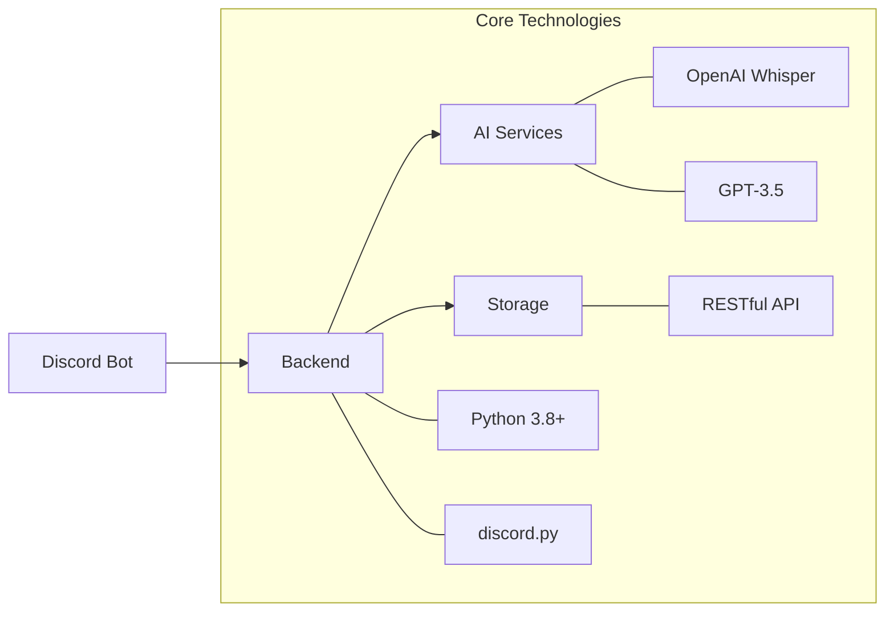

> **Riv**는 AI 기술을 통해 어렵고, 복잡하고, 귀찮았던 우리의 회의를  
> 쉽고, 간편하고, 즐거운 회의로 바꿔줍니다. Riv와 함께 우리의 세상을 바꿔나가고 싶지 않나요?  
> Riv는 오픈소스 프로젝트입니다. 우리 함께 열려있는 협업 세상을 만들어봐요!

## 📄 [**Riv 매뉴얼**](https://www.figma.com/slides/eJadhMIzsKJx38TjyWVmJj/%EC%98%A4%ED%94%88%EC%86%8C%EC%8A%A4-%EC%B5%9C%EC%A2%85?node-id=5-485&t=IJA0gQoLzIs2Gc29-0)

# Riv-Bot 🎙️

### AI 기반 회의록 자동화 솔루션

> **생각은 회의에, 기록은 RIV에 맡기세요!**  
> 귀찮고 복잡했던 회의를 쉽고 즐거운 경험으로 바꾸는 오픈소스 프로젝트

## 🌟 Riv가 특별한 이유

Riv-Bot은 Discord 기반의 **AI 파워드 회의 도우미**입니다. 음성 채널의 대화를 실시간으로 녹음하고, OpenAI의 최신 기술을 활용하여 스마트한 회의록을 자동으로 생성합니다.

### 📚 Riv 프로젝트 구성
- [**Riv Bot**](https://github.com/OpenRiv/riv-bot) - AI 기반 Discord 회의 비서
- [**Riv Frontend**](https://github.com/OpenRiv/riv-frontend) - 직관적인 회의록 관리 인터페이스
- [**Riv Backend**](https://github.com/OpenRiv/riv-backend) - 안정적인 서비스 인프라

## 💫 핵심 기능

<table>
<tr>
<td width="50%">

### 🎤 실시간 음성 처리
- Discord 음성 채널 실시간 녹음
- Whisper API 기반 고정밀 음성 인식
- 다중 화자 자동 구분

</td>
<td width="50%">

### 📝 스마트 회의록
- GPT 기반 회의 내용 자동 요약
- 핵심 결정사항 추출
- 구조화된 마크다운 문서 생성

</td>
</tr>
<tr>
<td>

### 🏷️ 유연한 카테고리
- 서버 역할 기반 자동 분류
- 커스텀 카테고리 지원
- 직관적인 UI/UX

</td>
<td>

### 🛡️ 안정적인 시스템
- 세밀한 로깅 시스템
- 자동 에러 복구
- 보안 통신 지원

</td>
</tr>
</table>

## 🔧 기술 스택

## 🤝 함께 만드는 Riv

Riv는 열린 마음으로 여러분의 참여를 기다립니다! 더 나은 회의 문화를 만드는 여정에 함께해주세요.

### [📖 매뉴얼 보기](https://raw.githubusercontent.com/OpenRiv/.github/main/profile/docs/riv_manual.pdf) | [🚀 시작하기](#) | [💡 기여하기](#)

